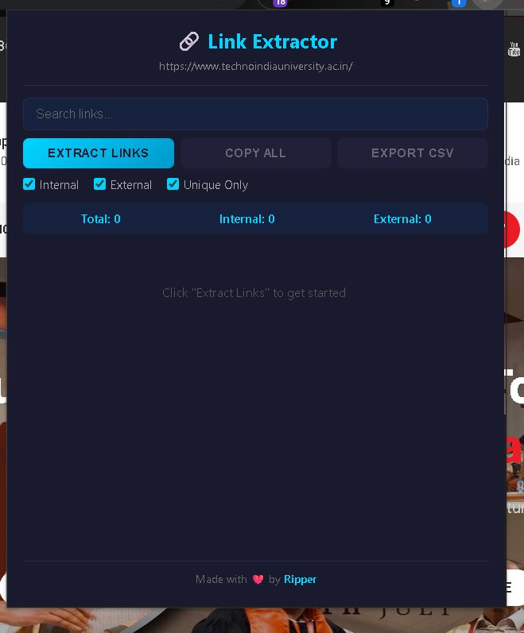
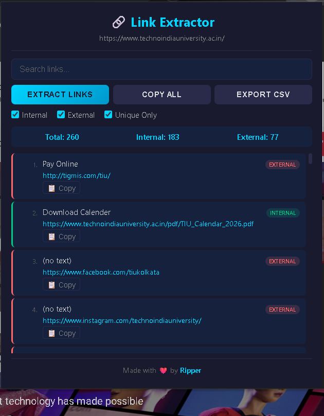
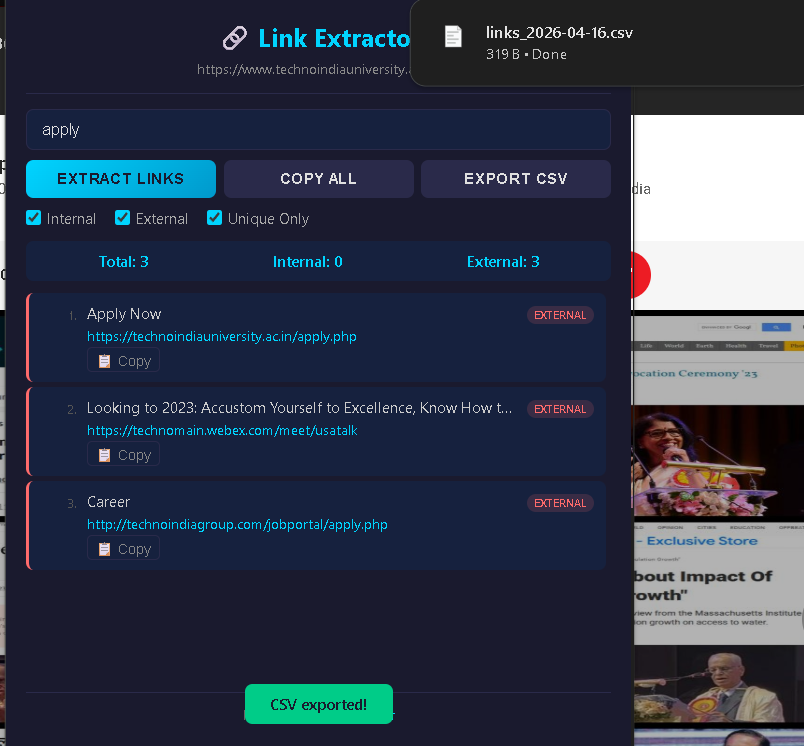

<div align="center">

# 🔗 Link Extractor

### A Powerful Chrome Extension to Extract All Links from Any Webpage

[](https://opensource.org/licenses/MIT)
[](https://www.google.com/chrome/)
[](https://developer.chrome.com/docs/extensions/mv3/)
[](https://github.com/ripper)
[]()
[](https://github.com/ripper/link-extractor)

<p align="center">
  <strong>Extract • Search • Filter • Export</strong>
</p>

<p align="center">
  Instantly extract all hyperlinks from any webpage with one click.<br>
  Search, filter, copy, and export links effortlessly.
</p>

---



</div>

---

## 📋 Table of Contents

- [Features](#-features)
- [Screenshots](#-screenshots)
- [Installation](#-installation)
- [How to Use](#-how-to-use)
- [Tech Stack](#-tech-stack)
- [Project Structure](#-project-structure)
- [Permissions Explained](#-permissions-explained)
- [Contributing](#-contributing)
- [License](#-license)
- [Author](#-author)

---

## ✨ Features

| Feature | Description |
|---------|-------------|
| 🔍 **Extract All Links** | Finds every `<a href>` link on the current webpage |
| 🏷️ **Smart Classification** | Automatically labels links as **Internal** or **External** |
| 🔎 **Real-time Search** | Instantly search through extracted links by URL or text |
| 🎛️ **Advanced Filters** | Filter by Internal, External, or Unique links |
| 📋 **Copy Individual Link** | One-click copy button for each link |
| 📋 **Copy All Links** | Copy all filtered links to clipboard at once |
| 📤 **Export to CSV** | Download all extracted links as a CSV spreadsheet |
| 📊 **Live Statistics** | Shows total, internal, and external link counts |
| 🌙 **Dark Theme UI** | Beautiful dark-themed modern interface |
| ⚡ **Lightweight & Fast** | No background processes, runs only when you click |
| 🔒 **Privacy Focused** | No data collection, no external requests |

---

## 📸 Screenshots

<div align="center">

### Main Interface


### Extracted Links with Filters


### Search & Export


</div>

---

## 🚀 Installation

### Method 1: Manual Installation (Developer Mode)

1. **Download** this repository

   ```bash
   git clone https://github.com/ankit-711-root/link-extractor.git

   OR click the green Code button → Download ZIP → Extract it

Open Chrome and navigate to:

javascript
Run Code

Copy code
chrome://extensions/


Enable Developer Mode (toggle in the top-right corner)

Click "Load unpacked"

Select the link-extractor folder you downloaded

✅ The extension icon will appear in your toolbar!